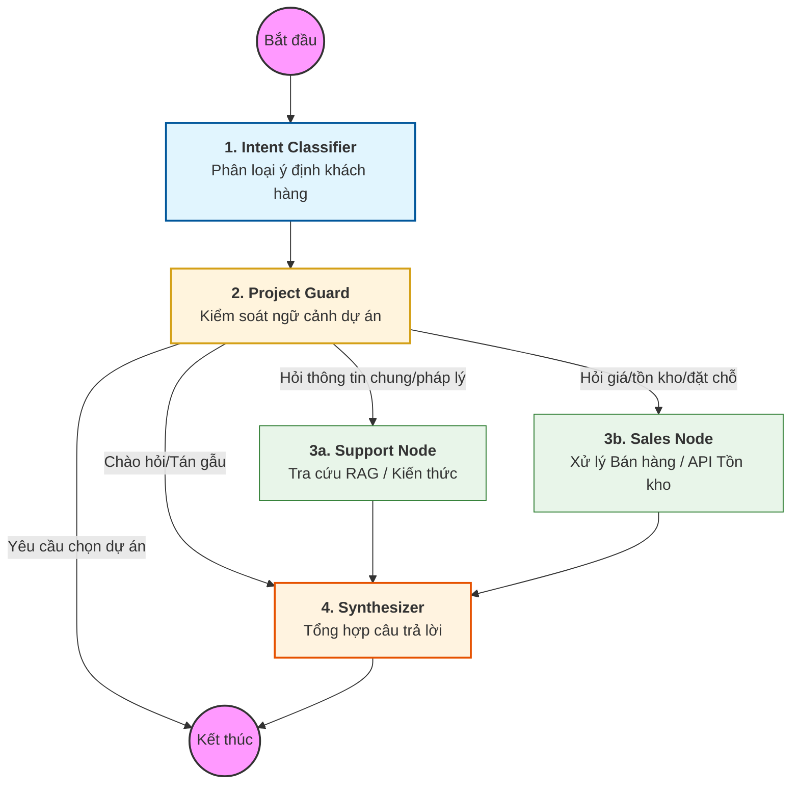

# Kiến trúc hệ thống Chatbot CSKH & Bán hàng (LangGraph)

Tài liệu này mô tả chi tiết kiến trúc của Agentic Chatbot sử dụng LangGraph, giúp kiểm soát luồng hội thoại và trạng thái khách hàng một cách chặt chẽ.

## 1. Đồ thị luồng xử lý (Agent Graph)

Dưới đây là sơ đồ Mermaid mô tả các Node và Edge trong hệ thống:

## 2. Chi tiết các Node xử lý

### 1. Intent Classifier
Sử dụng LLM để phân loại yêu cầu của người dùng vào các nhóm chính:
- `customer_support`: Câu hỏi về thông tin, pháp lý, vị trí.
- `sales_inquiry`: Câu hỏi về giá, tình trạng căn hộ.
- `booking_intent`: Muốn giữ chỗ hoặc đặt lịch.
- `chitchat`: Chào hỏi thông thường.

### 2. Project Guard (Chốt chặn quan trọng)
Kiểm tra xem câu hỏi có yêu cầu ngữ cảnh dự án cụ thể hay không. Nếu khách hàng chưa chọn dự án, node này sẽ trả về yêu cầu chọn dự án và kết thúc luồng ngay lập tức để tránh trả lời sai.

### 3a. Support Node (RAG Pipeline)
Kết nối với **Qdrant (Vector Database)** để trích xuất các đoạn văn bản liên quan đến dự án đã chọn. Sử dụng kỹ thuật RAG để trả lời chính xác dựa trên tài liệu pháp lý và tài liệu dự án.

### 3b. Sales Node (Sales Intelligence)
Tương tác với **Sales API Adapter** để lấy dữ liệu thời gian thực:
- Tra cứu bảng hàng, giá bán.
- Tính toán mức độ khan hiếm (`ScarcityLevel`).
- Áp dụng kịch bản bán hàng dựa trên giai đoạn tâm lý (`CustomerStage`).

### 4. Synthesizer
Nhận dữ liệu từ các node chuyên môn và biên soạn lại thành một câu trả lời hoàn chỉnh. Đảm bảo:
- Văn phong chuyên nghiệp, thân thiện.
- Đầy đủ nguồn trích dẫn (`SourceRef`).
- Đề xuất bước tiếp theo (Call to Action).

## 3. Quản lý trạng thái (Agent State)

Hệ thống sử dụng một State chung truyền qua các node, bao gồm:
- `messages`: Lịch sử hội thoại.
- `customer_stage`: Giai đoạn của khách hàng (Awareness, Consideration, Decision).
- `usps_used`: Danh sách các điểm bán hàng độc đáo đã được giới thiệu.
- `scarcity_level`: Mức độ khan hiếm căn hộ để tạo FOMO phù hợp.
- `project_name`: Tên dự án đang được thảo luận.

---
*Tài liệu này được tạo tự động bởi AI Coding Assistant.*
